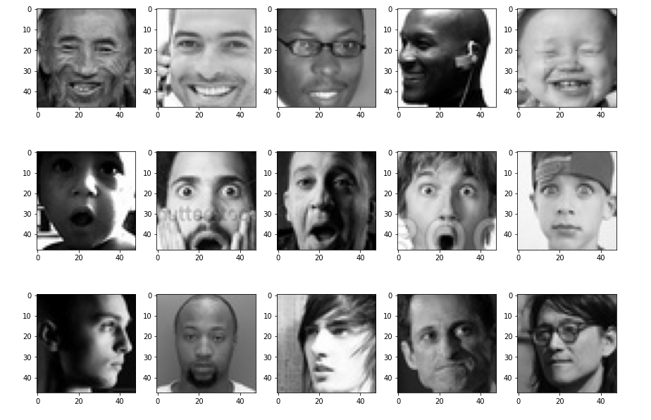

# Face-Expression-Recognizer
Face Expression Recognizer is a Application which takes a video stream as input and plot the Emotion of the Person in images. This application is built using Keras and Flask for deployment. The Model achieves an accuracy of 77% with 100 epochs of training. The batch size used is 64.

## Dataset : 
The Dataset used for Training the model is from [fer2013](https://www.kaggle.com/deadskull7/fer2013) which consist of 35886 images of seven universal emotions( **Anger, Disgust, Fear, Happy, Neutral, Sad, Surprise**). The Dataset is divided in 80% training images and 20% testing images. The images are 40x40 **Grayscale** images.

Some images in dataset are following:

  

## Model Summary:

    Model: "sequential"
    _________________________________________________________________
    Layer (type)                 Output Shape              Param #   
    =================================================================
    conv2d (Conv2D)              (None, 48, 48, 64)        640       
    _________________________________________________________________
    batch_normalization (BatchNo (None, 48, 48, 64)        256       
    _________________________________________________________________
    activation (Activation)      (None, 48, 48, 64)        0         
    _________________________________________________________________
    max_pooling2d (MaxPooling2D) (None, 24, 24, 64)        0         
    _________________________________________________________________
    dropout (Dropout)            (None, 24, 24, 64)        0         
    _________________________________________________________________
    conv2d_1 (Conv2D)            (None, 24, 24, 128)       204928    
    _________________________________________________________________
    batch_normalization_1 (Batch (None, 24, 24, 128)       512       
    _________________________________________________________________
    activation_1 (Activation)    (None, 24, 24, 128)       0         
    _________________________________________________________________
    max_pooling2d_1 (MaxPooling2 (None, 12, 12, 128)       0         
    _________________________________________________________________
    dropout_1 (Dropout)          (None, 12, 12, 128)       0         
    _________________________________________________________________
    conv2d_2 (Conv2D)            (None, 12, 12, 512)       590336    
    _________________________________________________________________
    batch_normalization_2 (Batch (None, 12, 12, 512)       2048      
    _________________________________________________________________
    activation_2 (Activation)    (None, 12, 12, 512)       0         
    _________________________________________________________________
    max_pooling2d_2 (MaxPooling2 (None, 6, 6, 512)         0         
    _________________________________________________________________
    dropout_2 (Dropout)          (None, 6, 6, 512)         0         
    _________________________________________________________________
    conv2d_3 (Conv2D)            (None, 6, 6, 512)         2359808   
    _________________________________________________________________
    batch_normalization_3 (Batch (None, 6, 6, 512)         2048      
    _________________________________________________________________
    activation_3 (Activation)    (None, 6, 6, 512)         0         
    _________________________________________________________________
    max_pooling2d_3 (MaxPooling2 (None, 3, 3, 512)         0         
    _________________________________________________________________
    dropout_3 (Dropout)          (None, 3, 3, 512)         0         
    _________________________________________________________________
    flatten (Flatten)            (None, 4608)              0         
    _________________________________________________________________
    dense (Dense)                (None, 256)               1179904   
    _________________________________________________________________
    batch_normalization_4 (Batch (None, 256)               1024      
    _________________________________________________________________
    activation_4 (Activation)    (None, 256)               0         
    _________________________________________________________________
    dropout_4 (Dropout)          (None, 256)               0         
    _________________________________________________________________
    dense_1 (Dense)              (None, 512)               131584    
    _________________________________________________________________
    batch_normalization_5 (Batch (None, 512)               2048      
    _________________________________________________________________
    activation_5 (Activation)    (None, 512)               0         
    _________________________________________________________________
    dropout_5 (Dropout)          (None, 512)               0         
    _________________________________________________________________
    dense_2 (Dense)              (None, 7)                 3591      
    =================================================================
    Total params: 4,478,727
    Trainable params: 4,474,759
    Non-trainable params: 3,968
    
## Installation :
Once You have cloned the Face Expression Recognizer then run the follwing command:

Before running these commmand make sure that the path of video is correct in camera.py file. If you want to use webcam set path to 0.

     cd \path\to\Project\
     pip install pipenv
     pipenv install
     pipenv run python3 main.py
     
After running these command open in browser 0.0.0.0:5000 to see the face reccognizer work.

If you want to train the model yourself then first unzip the test and train folder and then run **facial_expression_training.py**

    unzip train.zip
    unzip test.zip
    python3 facial_expression_training.py
